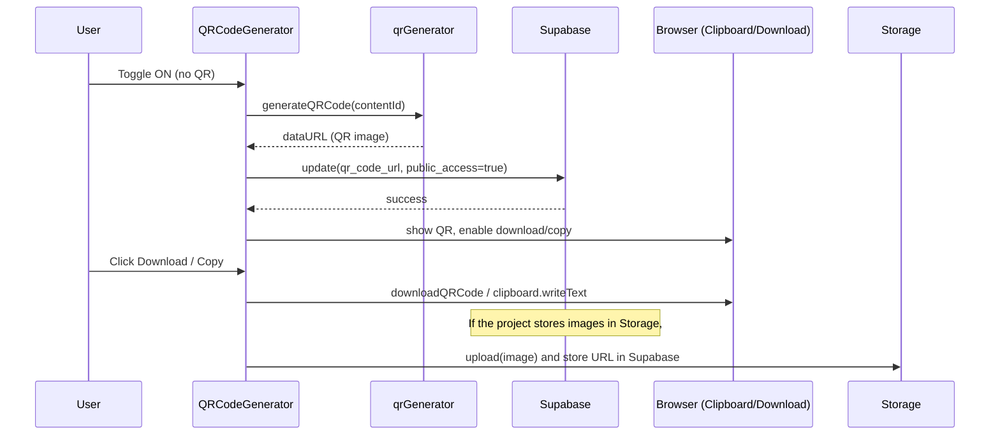

# QR Code & AR Access — Workflow

## Overview
This document describes the end-to-end QR code generation and public AR access workflow implemented by the `QRCodeGenerator` React component (`src/components/ar/QRCodeGenerator.tsx`). It explains the component contract, state, step-by-step flow, Supabase DB interactions, error handling, edge cases, testing suggestions, and next steps.

## Contract (inputs / outputs / side-effects)
- Inputs:
  - `contentId: string` — unique id of the module content row (maps to `module_content.id`).
  - `title: string` — used for naming downloaded QR images.
  - `currentPublicAccess?: boolean` — initial public access state.
  - `currentQRUrl?: string` — optional pre-existing QR Data URL.
  - `onUpdate?: () => void` — callback invoked after DB updates.
- Outputs / Side-effects:
  - Generates a QR data URL (image) and stores it in component state (`qrCodeUrl`).
  - Updates `module_content` row in Supabase: `qr_code_url` and `public_access` fields.
  - Provides ability to download the QR image and copy/open the AR URL.
  - Shows toasts for success / error messages.

## Component state and important variables
- `isPublic` (boolean) — whether the content should be publicly accessible.
- `qrCodeUrl` (string) — data URL of the generated QR image.
- `isGenerating` (boolean) — indicates QR generation in progress.
- `isUpdating` (boolean) — indicates DB update in progress.
- `arUrl` (string) — generated AR URL, derived using `getARUrl(contentId)`.

## Utilities and integrations used
- Utils (from `src/utils/qrGenerator`):
  - `generateQRCode(contentId)` — returns a Data URL string representing the QR image for the AR URL.
  - `downloadQRCode(dataUrl, filename)` — triggers a download of the QR image.
  - `getARUrl(contentId)` — compute the AR experience URL for the content id.
- Supabase client (`supabase` from `src/integrations/supabase/client`) — used to persist `qr_code_url` and `public_access` on the `module_content` table.
- Toasts — user feedback using `useToast` hook.

## DB schema notes (as used by the component)
- Table: `module_content`
- Fields of interest:
  - `id` (primary key)
  - `qr_code_url` (string / text) — stores QR data URL or hosted URL
  - `public_access` (boolean)

## Step-by-step workflow
1. Initial render:
   - Component receives `currentPublicAccess` and `currentQRUrl` props and initializes local state accordingly.
   - `arUrl` is computed with `getARUrl(contentId)`.

2. User toggles "Enable Public AR Access" (`Switch`):
   - `handlePublicToggle(checked)` is invoked.
   - UI immediately sets `isPublic = checked` (optimistic update).

3. If toggled ON and a QR does not already exist:
   - `generateQRCodeForContent()` is called.
   - `isGenerating` set to true.
   - Calls `generateQRCode(contentId)` to produce a data URL for the QR code pointing to `arUrl`.
   - On success:
     - Sets `qrCodeUrl` in state.
     - Calls `updateContentQRData(qrDataURL, isPublic)` to persist `qr_code_url` and `public_access` in Supabase.
     - Shows success toast.
   - On failure:
     - Shows error toast and logs error. `isGenerating` is cleared.

4. If toggled ON and QR already exists:
   - The component reuses `qrCodeUrl` (no generation required) and calls `updateContentQRData(qrCodeUrl, true)` to set public access.

5. If toggled OFF:
   - Calls `updateContentQRData(qrCodeUrl, false)` to set `public_access = false` in DB.
   - Leaves `qr_code_url` as-is (component preserves generated image) — the QR image may still exist but AR access will be restricted server-side depending on how `public_access` is enforced.

6. Downloading QR:
   - Clicking "Download" runs `handleDownloadQR()` which calls `downloadQRCode(qrCodeUrl, filename)` using the `title` prop to build filename.

7. Copying/opening AR URL:
   - `handleCopyArUrl()` copies `arUrl` to clipboard and shows a toast.
   - The Eye/Open button uses `window.open(arUrl, '_blank')` to preview the AR experience.

## Supabase update flow (implementation details)
- `updateContentQRData(qrUrl, publicAccess)` executes:
  - `supabase.from('module_content').update({ qr_code_url: qrUrl, public_access: publicAccess }).eq('id', contentId)`
- Behavior expectations:
  - On success: calls `onUpdate?.()` to let parent refresh lists or re-fetch content.
  - On error: throws and the calling function shows an error toast and reverts optimistic UI if necessary.

## Error handling
- Generation errors: caught in `generateQRCodeForContent` — the user is shown an error toast and `isGenerating` cleared.
- DB update errors: caught in `updateContentQRData` — the error is re-thrown to the caller where UI may revert (e.g., `setIsPublic(!checked)` in `handlePublicToggle`).
- Clipboard errors: caught and shown as destructive toasts.
- Download errors: unlikely (client-side) but should be logged and shown to the user.

## Edge cases and recommendations
- Large or slow QR generation: keep `isGenerating` to prevent duplicate requests; show progress spinner and disable toggle while generating.
- Partial failures: e.g., QR generation succeeds but DB update fails. Current code throws and the QR remains in state while DB isn't updated. Consider adding a retry/backoff or storing the image in a temporary object store and marking sync state.
- Race conditions: Rapidly toggling public access could send overlapping updates. Consider queuing or disabling the toggle while `isUpdating` is true (component already sets `disabled={isUpdating}` on the `Switch`).
- Persistent hosting: Currently QR is stored as a data URL in `qr_code_url`. Consider hosting the image in object storage and storing a public URL to reduce payload size and improve caching.
- Authorization: Ensure Supabase policies only allow the rightful owner or admin to change `public_access`.

## Tests to add
- Unit tests for the helper utilities in `src/utils/qrGenerator` (generate, download, and URL generation).
- Component tests (React Testing Library):
  - Toggle switch ON triggers generation when there is no QR.
  - Toggle switch ON with existing QR triggers `supabase.update` call but no `generateQRCode` call.
  - Toggle switch OFF triggers `supabase.update(... public_access = false)`.
  - Error flows show error toasts and revert optimistic UI where appropriate.

## Quick checklist for maintainers
- Ensure `getARUrl` returns the canonical AR entry URL for `contentId`.
- Review Supabase Row Level Security (RLS) policies for `module_content` to prevent unauthorized public access changes.
- Decide if `qr_code_url` should be a data URL or a hosted image URL; switch to storage if images grow large.

## Next steps / improvements
- Store generated QR images in Supabase Storage (or S3) and save a public asset URL instead of a data URL.
- Add server-side validation for `public_access` changes (audit logs, role checks).
- Add automated retries for DB commit failures.
- Add a small UX improvement: a confirmation modal when enabling public access (to warn that content will be publicly reachable).

---

File: `src/components/ar/QRCodeGenerator.tsx` was the reference for this workflow.

## Visualization

Below are two visual representations (a flowchart and a sequence diagram) showing how the QR code / AR access workflow maps onto your project files and runtime interactions.

### Flowchart (component-level)

```mermaid
flowchart TD
  subgraph UI
    U[User]
    QRComp[QRCodeGenerator\n(src/components/ar/QRCodeGenerator.tsx)]
  end
  subgraph Utils
    QRGen[qrGenerator\n(src/utils/qrGenerator.ts)]
    ARUrl[getARUrl]
    Download[downloadQRCode]
  end
  subgraph Backend
    Supabase[(Supabase\nmodule_content)]
    Storage[(Optional: Supabase Storage / S3)]
  end

  U -->|clicks toggle / buttons| QRComp
  QRComp -->|calls getARUrl(contentId)| ARUrl
  QRComp -->|generateQRCode(contentId)| QRGen
  QRGen -->|returns data URL| QRComp
  QRComp -->|update {qr_code_url, public_access}| Supabase
  QRComp -->|download| Download
  QRComp -->|copy/open| U
  QRComp -->|optionally upload image| Storage
  Supabase -->|serves AR endpoint| U
```

### Sequence diagram (runtime interactions)



### Node-to-file mapping

- QRCodeGenerator component: `src/components/ar/QRCodeGenerator.tsx`
- QR utilities: `src/utils/qrGenerator.ts` (functions: `generateQRCode`, `downloadQRCode`, `getARUrl`)
- Supabase client: `src/integrations/supabase/client` (used by `updateContentQRData`)
- Toasts: `src/hooks/use-toast` (visual feedback)
- DB table: `module_content` (fields: `qr_code_url`, `public_access`)

### How to render/export these diagrams

1. GitHub renders Mermaid blocks in Markdown automatically on supported platforms. VS Code can render them with the "Markdown Preview Mermaid Support" extension.
2. To export to PNG/SVG locally, extract the Mermaid blocks to a `.mmd` file and use the Mermaid CLI. Example PowerShell commands:

```powershell
# Install (global or use npx)
npm install -g @mermaid-js/mermaid-cli

# Save the mermaid content to `docs/qr-workflow.mmd` and then render:
mmdc -i docs/qr-workflow.mmd -o docs/qr-workflow.png

# Or with npx (no global install):
npx @mermaid-js/mermaid-cli -i docs/qr-workflow.mmd -o docs/qr-workflow.png
```

Tips:
- If you keep the Mermaid blocks inside this Markdown, copy them into a `.mmd` file before running the CLI.
- Choose a theme with `-t` (e.g., `-t neutral`) if you want consistent visuals.

### Notes & next steps

- If you'd like, I can add a standalone `docs/qr-workflow.mmd` and produce a PNG in the repo.
- I can also generate a simple SVG export and add it to a `docs/` folder for quick visual reference in your README.
